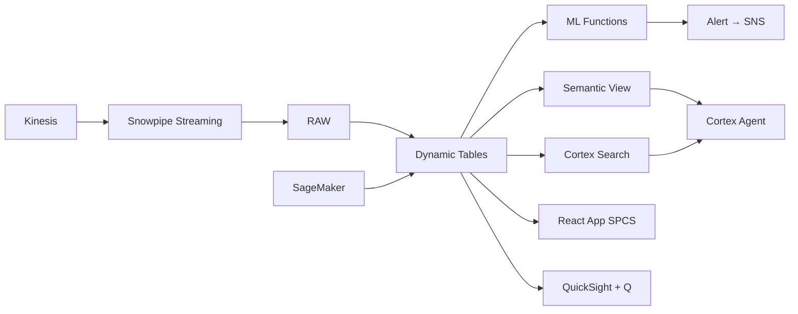

# Digital Wallet & Payments Hub Analytics

GCash and Maya have 90M+ accounts — Snowflake detects payment fraud in real-time with anomaly detection, monitors wallet ecosystem health, and alerts on suspicious patterns before losses materialize.

## Architecture

Philippine digital wallets have exploded — GCash alone has 90M+ registered accounts. A growing fintech processes ₱42 billion monthly through 4.5M active wallets. But fraud is evolving: account takeovers, QR code scams, and merchant collusion cost the industry billions. Traditional batch fraud systems detect attacks hours after damage is done. Snowflake processes every transaction in real-time.



## Snowflake Capabilities

| Capability | Implementation |
|-----------|---------------|
| Dynamic Tables | TRANSACTION_VELOCITY / MERCHANT_RISK_PROFILE / ECOSYSTEM_HEALTH / FRAUD_TIMESERIES |
| ML Functions | ML.ANOMALY_DETECTION + ML.CLASSIFICATION |
| Cortex AI | AI_CLASSIFY, COMPLETE |
| Cortex Search | 8500 documents indexed |
| Cortex Agent | WALLET_INTELLIGENCE_AGENT |
| Semantic View | WALLET_ANALYTICS |
| React App (SPCS) | 5 tabs + DemoGuide |


## AWS Services

| Service | Role in Demo |
|---------|-------------|
| Amazon Kinesis | Stream 18M monthly payment transactions in real-time |
| Amazon SageMaker | Real-time fraud scoring model |
| Amazon Neptune | Graph-based fraud ring detection |
| Amazon SNS | Real-time fraud alert notifications |
| Amazon QuickSight + Q | Payments operations dashboard |
| AWS Lambda | Event-driven fraud scoring functions |


## Personas

| Persona | Role | Key Questions |
|---------|------|---------------|
| **Jennifer Grace Lim-Napoles** | Chief Risk Officer | "What's our fraud rate by transaction type?" "Which merchant categories are highest risk?" |
| **Marco Antonio Pangilinan** | Payments Product Manager | "What's the daily active transacting user count?" "Which payment channels are growing fastest?" |


## Data

| Table | Rows | Description |
|-------|------|-------------|
| WALLET_ACCOUNTS | 4,500,000 | Wallet user accounts (anonymized demographics, KYC tier) |
| TRANSACTIONS | 18,000,000 | 30 days of payment transactions (P2P, bills, QR, top-up) |
| MERCHANTS | 125,000 | Merchant profiles (sari-sari stores to malls) |
| FRAUD_CASES | 8,500 | Confirmed fraud cases for model training |
| DEVICE_SIGNALS | 5,000,000 | Device fingerprints and login behavior |
| NETWORK_GRAPH | 2,200,000 | Account-to-account transfer relationships |


## Build Instructions

### Prerequisites
- Snowflake account with ACCOUNTADMIN access
- Cortex AI enabled (ML Functions, Search, Agent)
- Warehouse: WALLET_WH (Medium)
- AWS CLI with access (us-west-2)

### Deployment

```bash
snowsql -f snowflake/00_setup.sql
snowsql -f snowflake/01_marketplace_install.sql
snowsql -f snowflake/02_raw_tables.sql
snowsql -f snowflake/03_staging.sql
snowsql -f snowflake/04_dynamic_tables.sql
snowsql -f snowflake/05_search.sql
snowsql -f snowflake/06_ml_models.sql
snowsql -f snowflake/07_semantic_view.sql
snowsql -f snowflake/08_agent.sql
```

### React App (SPCS)
```bash
cd app && npm ci && npm run build
docker build -t aws-philippines-remittance-digital-wallet-app .
docker push bdiqc8sm-default.registry.snowflakecomputing.com/digital_wallet/app/aws_philippines_remittance_digital_wallet/app:latest
```

### Demo Mode
Open the app URL with `?demo=true` for presenter view.

## Build Modes

### Snowflake Only
Run scripts 00-08 (skip AWS-specific integration). Uses:
- **Snowpipe Streaming SDK** instead of Amazon Kinesis
- **ML.ANOMALY_DETECTION + ML.CLASSIFICATION (native)** instead of Amazon SageMaker
- **Network analysis via SQL (CONNECT BY / recursive CTEs)** instead of Amazon Neptune
- **Alerts + Notification Integration** instead of Amazon SNS
- **Snowflake Intelligence (Cortex Analyst)** instead of Amazon QuickSight + Q
- **Task Graphs + Alerts (event-driven)** instead of AWS Lambda

### Full AWS + Snowflake
Run all scripts including AWS integration. Deploy QuickSight dashboard from `quicksight/`.

## Business Impact

Industry research and Snowflake customer outcomes:
- **Philippine digital payments reached ₱8.7 trillion in 2023 — 52.8% of total retail payments** — [BSP](https://www.bsp.gov.ph/Pages/digital-payments-transformation.aspx)
- **GCash reached 94M registered users in Philippines by end of 2023** — [Globe Fintech](https://www.globe.com.ph/about-us/newsroom.html)
- **Digital payment fraud losses in APAC grew 28% in 2023 to $4.2B** — [LexisNexis Risk](https://risk.lexisnexis.com/global/en/insights-resources/research)
- **Real-time fraud detection reduces losses by 50-70% vs batch processing** — [McKinsey Payments](https://www.mckinsey.com/industries/financial-services/our-insights/global-payments)
- **Western Union** (Snowflake customer): processes 1B+ cross-border transactions on Snowflake with real-time compliance and fraud detection across 200+ countries -- [snowflake.com/customers/western-union](https://www.snowflake.com/en/customers/all-customers/case-study/western-union/)

## Key Demo Numbers

- **₱42B** monthly total payment volume
- **18M transactions** processed monthly across 4 channels
- **0.047%** current fraud rate (approaching 0.05% threshold)
- **342 accounts** flagged as high fraud probability this week
- **4.5M** active wallet accounts
- **125,000 merchants** onboarded (42% sari-sari stores)


## License

Apache 2.0 — See [LICENSE](LICENSE) for details.

This is a personal demo project and is not an official Snowflake offering. It comes with no support or warranty.